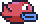

# **Fifty Bird**

> Reading Materials (Books): <br/> > ["How to make and RPG" - Dan Schuller ](https://howtomakeanrpg.com/) <br/> > ["Game Programming Patterns" - Robert Nystrom ](https://gameprogrammingpatterns.com/)

## **bird0 (Day-0 Update)**

`love.graphics.newImage(path)` : loads an image from a graphics file (.jepg, .jpg, .png, etc), stroring it in an object we can draw to the screen.

```lua
-- local is a access specifier
local background = love.graphics.newImage("background.png")
local ground = love.graphics.newImage("ground.png")

-- to draw the image object to the screen, in love.draw()
function love.draw()
    push:start()
    love.graphics.draw(background, 0, 0) -- draw from top-left of screen
    love.graphics.draw(ground, 0, VIRTUAL_HEIGHT-16) -- draw at the bottom of screen
    push:finish()
end
```

## **bird1 (Parallax Update)**

The game must be scrolling infinitely, and also the background must scroll at a different speed than the foreground, which is called as the **_parallax effect_**.

**_Parallax Effect_**: Illusion of movement given by 2 frames that are moving at different rates.

For this effect, we need to keep track and update the **_x-axis offset_**. So, we need to keep track of how much to "scroll". Also we need a speed at which the 2 frames move.

```lua
local backgroundScroll = 0
local groundScroll = 0

local BACKGROUND_SCROLL_SPEED = 30
local GROUND_SCROLL_SPEED = 60

-- using the scroll values while drawing the images
love.graphics.draw(background, -backgroundScroll, 0)
love.graphics.draw(ground, -groundScroll, VIRTUAL_HEIGHT-16)
```

Also, if we just allow the image to scroll infinitely, at some point we scroll farther than the image, so we have to loop the image. So, we can set a looping point after which the image is drawn again.

```lua
-- ... other variable declarations

-- the background image we have has trees, mountains
-- so it is important where it gets cut-off and is re-drawn
-- this point must be found out just by trial & error
-- as there is no global value we can use
local BACKGROUND_LOOPING_POINT = 413 -- specific to the image we have

-- ...
-- function love.resize(w,h) ...
-- function love.keypressed(key) ...
-- ...

function love.update(dt)
    -- updating backgound scroll
    -- * dt makes it frame-rate independent
    backgroundScroll = (backgroundScroll + BACKGROUND_SCROLL_SPEED * dt)
        % BACKGROUND_LOOPING_POINT

    -- the ground image we have is very consistent
    -- so wherever the image is cut-off and re-drawn there is not much difference
    groundScroll = (groundScroll + GROUND_SCROLL_SPEED * dt)
        % VIRTUAL_WIDTH
end

-- function love.draw() ...
-- ...
```

### **_bird2.1 (Bird Update)_**

Creating a **`Bird`** class to represent the bird.

```lua
--[[ Bird.lua ]]
Bird = Class {}

function Bird:init()
    self.image = love.graphics.newImage('bird.png')

    -- the return object of love.graphics.newImage() is itself an Image class
    -- it gives us methods like :getWidth() and :getHeight() of the Image object
    self.width = self.image:getWidth()
    self.height = self.image:getHeight()

    -- placing bird at the center of the screen
    self.x = VIRTUAL_WIDTH / 2 - (self.width / 2)
    self.y = VIRTUAL_HEIGHT / 2 - (self.height / 2)
end

-- rendering the bird sprite on screen
function Bird:render()
    love.graphics.draw(self.image, self.x, self.y)
end
```

Next we need to import it and use the Bird class in our main file (**`main.lua`**)

```lua
--[[ main.lua ]]

-- importing the Class library to use classes in out project
Class = require 'class' -- required while working with classes
-- importing the Bird class from Bird.lua
require 'Bird'

-- declarations
local bird = Bird() -- creating a bird variable to instantiate the Bird class
-- ...

function love.draw()
    push:start()
    love.graphics.draw(background, 0, 0)
    love.graphics.draw(ground, 0, VIRTUAL_HEIGHT-16)

    -- rendering the bird
    bird:render() -- calling the render() method of Bird class

    push:finish()
end

-- ...
```

## **bird3 (Gravity Update)**

**_Gravity_**: apply negative exponential value (speed of falling increases as we go down more) to the y-value i.e., **-ve dy (velocity)**

```lua
-- [[ Bird.lua ]]

Bird = Class{}
local GRAVITY = 20

-- function Bird:init()
-- function Bird:render()

function Bird:render(dt)
    -- applying gravity (self.dy + GRAVITY) to velocity (self.dy)
    -- * dt makes it frame-rate independent
    self.dy = self.dy + GRAVITY * dt
    self.y = self.y + self.dy -- applying the velocity to the y-value
end
```

```lua
--[[ main.lua ]]
-- ...

function love.update(dt)
    -- ...
    -- calling the update() method of Bird class
    bird:update(dt)
end
```

The "GRAVITY" we added is the **_g : gravity_**, but the bird is also able to "jump", so we need some way to apply **anti-gravity**, which is the **_j : jump velocity_**



## **bird4 (Anti-Gravity Update)**

```lua
-- [[ main.lua ]]
-- ...

-- when any key is pressed, love calls this function
-- but it doesn't store which key was pressed
-- by using our new love.keyboard.keysPressed table,
-- we are able to store which key was pressed
function love.keypressed(key)
    love.keyboard.keysPressed[key] = true


    -- general logic to quit game
   if key == 'escape' then
        love.event.quit()
    end
end
-- ...

-- this is also another custom function we are adding to the love.keyboard
-- using this we can query the table whenever needed to check for keypress
function love.keyboard.wasPressed(key)
    -- check value of the given key's entry in love.keyboard.keysPressed
    -- it tells if on the last frame, was a given key pressed
    if love.keyboard.keysPressed[key] then
        return true
    else
        return false
    end
end

function love.update(dt)
    -- ...

    -- love.keyboard is an inbuilt table (like a dictionary)
    -- we are adding a new key called "keysPressed"
    love.keyboard.keysPressed = {}

    -- the above gets re-initialized to empty every frame
    -- this is important because we need to clear the table at some point
    -- the table we are using is mainly to check if a key was pressed "once"
    -- so if the table is not flushed, any key pressed at any point remains true
end
```

All this was so that we can query single key presses, outside **`main.lua`**, asn the only other function that would allow us to do that was **`love.keydown()`** which tells is a key is held down not single-presses. So now by doing this, we can access the keypresses outside, in **`Bird.lua`**

```lua
-- [[ Bird.lua ]]
-- ...

function Bird:update(dt)
    -- ...

    -- here we are able to use the custom function and property from main.lua
    if love.keyboard.wasPressed('space') then
        self.dy = -5 -- anti-gravity velicity
        -- so whenever "space" is pressed, the bird moves up by 5 pixels
    end
end
```

## **bird5 (Pipe Update)**

- Firstly, the pipes must be "infinitely" spawning
- Next, we need to find out where and when to spawn them, and also not just keep spawning infinitely, as if we allow that the pipes will not stop spawning and will take up all the resources and crash the game.
- So, we need a mechanism to destroy those spawned pipes that move out of render distance and spawn pipes only within the render siatnce of the player.

Creating the **`Pipe`** class to represent a "pipe" in **`main.lua`**

```lua
Pipe = Class{}

-- created outside the init method because we need only 1 sprite
-- i.e., for every instance of pipe we shouldn't be creating a new pipe Image object
local PIPE_IMAGE = love.graphics.newImage('pipe.png')

-- we need to maintain a variable to scroll the pipes (-ve => move left)
local PIPE_SCROLL = -60


function Pipe:init()
    self.x = VIRTUAL_WIDTH -- spawn on right edge of screen

    -- with y-axiswe can;t generate it at same place every time
    -- need to randomize the y-level at which pip spawns
    -- VIRTUAL_HEIGHT / 4 -> first quarter of screen
    -- VIRTUAL_HEIGHT - 10 -> 10px above the bottom of screen
    self.y = math.random(VIRTUAL_HEIGHT / 4, VIRTUAL_HEIGHT - 10)

    self.width = self.PIPE_IMAGE:getWidth()
    self.height = self.PIPE_IMAGE:getHeight()
end

-- motion of pipes
function Pipe:update(dt)
    self.x = self.x + PIPE_SCROLL * dt
end

-- render or draw the pipe on screem
function Pipe:render()
    love.graphics.draw(PIPE_IMAGE, self.x, self.y)
end
```

Now to use the Pipe in **`main.lua`**.

```lua
-- [[ main.lua ]]

-- other imports
require 'Pipe'
require 'os' -- for seeding math.randomseed()
-- ...

-- declarations ...
-- a table to hold the pipes spawned
-- it will be like a dynamic array or linked list
-- we will just insert the pipes but not give any keys as
-- the table will be auto-indexed (1-indexed)
local pipes = {}

-- creating a variable to use as a timer
-- the timer will allow us to measure time by incrementing it in update
-- i.e., every frame (dt), timer can be incremented
-- and after it reaches some value, we can spawn a pipe
local spawnTimer = 0

function love.load()
    -- ...
    math.randomseed(os.time()) -- to be able to use math.random in Pipe.lua
    -- ...
end

-- ...
function love.update(dt)
    -- ...

    spawnTimer = spawnTimer + dt
    if spawnTimer > 2 then
        table.insert(pipes, Pipe{}) -- new Pipe object added to pipes table
        spawnTimer = 0
    end

    bird:update(dt)

    -- pairs(table) is like enumerate() in python
    -- it gives the indices as well as the key-value pairs of the table
    for k, pipe in pairs(pipes) do
        pipe:update(dt) -- scrolling of pipe

        -- pipe needs to be destroyed when out of render distance
        -- pipe.x < 0 => pipe's left edge touching left edge of screen
        -- pipe.x < -pipe.width => pipe's right edge touching left edge of screen
        if pipe.x < -pipe.width then
            table.remove(pipes, k) -- k associated with pipe
        end
    end
    -- ...
end

-- ...

function love.draw()
    push:start()

    -- render layer important because the overlapping should not be incorrect
    -- first background, over it pipes, and top of the pipes will be the ground

    -- render background first
    love.graphics.draw(background, -backgroundScroll, 0)

    -- pipes next
    for k, pipe in pairs(pipes) do
        pipe:render()
    end

    -- lastly render the ground
    love.graphics.draw(ground, -groundScroll, VIRTUAL_HEIGHT - 16)

    push:finish()
end
```

Right now the pipes will spawn at random heights (random y-value) from top-quarter of screen all the way up until 10px above the bottom of the screen, but the pipes are only on the ground facing up. In the actual flappy bird game, there are pipes in the sky, facing down from the top of the screen. Also, just 10px above the bottom of screen makes some pipes to randomly spawn very low so the 10 must be changes to around 30 or 40 as well.

## **bird6 (Pipe-Pair Update)**


For the "Pipe-Pairs", we create a new class called "PipePair", that is a composite of Pipe class.

Creating the **`PipePair`** class.

```lua
-- [[ PipePair.lua ]]
PipePair = Class{}

local GAP_HEIGHT = 90 --gap size between pipes
function PipePair:init(y)
    -- initialize pipes past the end of the screen
    self.x = VIRTUAL_WIDTH + 32

    -- y-value is for the topmost pipe; gap is a vertical shift of the second lower pipe
    -- y-value is passed to the class while instantiation
    self.y = y

    -- instantiate two pipes that belong to this pair, in a table 'pipes'
    -- self.y -> spawn in the sky
    -- self.y + PIPE_HEIGHT + GAP_HEIGHT -> spawn on ground
    -- also now Pipe() is taking 2 arguments: type and location of pipe
    self.pipes = {
        ['upper'] = Pipe('top', self.y),
        ['lower'] = Pipe('bottom', self.y + PIPE_HEIGHT + GAP_HEIGHT)
    }

    -- whether this pipe pair is ready to be removed from the scene
    self.remove = false
end

function PipePair:update(dt)
    -- remove pipe from screen if it moves beyonf left edge
    -- else move it leftward
    if self.x > -PIPE_WIDTH then
        self.x = self.x - PIPE_SPEED * dt
        self.pipes['lower'].x = self.x
        self.pipes['upper'].x = self.x
    else
        self.remove = true
    end
end

function PipePair:render()
    for k, pair in pairs(self.pipes) do
        pipe:render()
    end
end
```

As seen, there must be some changes made to **`Pipe.lua`** where the class constructor (_`Pipe:init()`_) must take 2 arguments and also render one of the pipes in inverted position.

```lua
-- [[ Pipe.lua ]]
-- global variables ...
PIPE_HEIGHT = 288
PIPE_WIDTH = 70

function Pipe:init(orientation, y)
    self.x = VIRTUAL_WIDTH
    self.y = y -- y-value passed to init

    self.width = PIPE_IMAGE:getWidth()
    self.height = PIPE_HEIGHT

    -- passed to init: 'top', or 'bottom'
    self.orientation = orientation
end

-- ...

function Pipe:render()
    -- self.orientation == 'top' and self.y + PIPE_HEIGHT or self.y
    -- here if orientation is 'top', then spawn at self.y + PIPE_HEIGHT
    -- else spawn at self.y and also for inverting 'top' pipes,
    -- self.orientation == 'top' and -1 or 1 where -1 flips the sprite
    love.graphics.draw(
        PIPE_IMAGE, -- sprite image
        self.x,     -- x-value to draw sprite at
        -- below is the y-value to draw sprite at
        (self.orientation == 'top' and self.y + PIPE_HEIGHT or self.y),
        0, -- rotation 0 because we don't want to roatate the image
        1, -- X-scale 1 => not scaled horizontally i.e., normal image width
        -- below is Y-scale that scales the image vertically
        -- so of the orientation is 'top' -1 scale mirror it along that axis
        -- else just the scale 1 means that no scaling applied
        self.orientation == 'top' and -1 or 1
    )
end
```

Now, we can import import the **`PipePair`** in **`main.lua`**, and make the necessary changes.

```lua
-- [[ main.lua ]]
-- imports ...
require 'PipePair'

-- declarations ...
local pipePairs = {}

-- storing the previous pipe spawn height to make the pipe spawning continuous
-- if it is just random, there might be chances where very less gap
-- so we want like a smooth continuous path for the bird to fly reasonably
local lastY = -PIPE_HEIGHT + math.random(80) + 20
-- ...

function love.update(dt)
    -- ...

    spawnTimer = spawnTimer + dt
    if spawnTimer > 2 then
        -- lastY + math.random(-20, 20) -> shifts the gap by 20px
        -- VIRTUAL_HEIGHT - 90 - PIPE_HEIGHT -> 90px gap always present
        -- so the "gap" will be from 10px on top of screen to 90px from bottom
        -- also a random [-20, 20]px gap randomization will be applied
        local y = math.max(-PIPE_HEIGHT + 10,
            math.min(lastY + math.random(-20, 20), VIRTUAL_HEIGHT - 90 - PIPE_HEIGHT))
        lastY = y

        -- new PipePair object added to pipePairs table, instead of pipes
        table.insert(pipePairs, PipePair(y))
        spawnTimer = 0
    end

    bird:update(dt)

    -- updating all the PipePair instances
    for k, pair in pairs(pipePairs) do
        pair:update(dt)
    end

    -- removing pipes that moves across the render distance
    -- a second loop required, other than the previous loop because,
    -- modifying table in-place without explicit keys will result in skipping
    -- next pipe, since all implicit keys (numerical indices) are
    -- automatically shifted down after tabLe removal
    for k, pair in pairs(pipePairs) do
        if pair.remove then
            table.remove(pipePairs, k)
        end
    end
end

-- ...
function love.draw()
    -- ...
    -- using pipePairs instead of pipes
    for k, pair in pairs(pipePairs) do
        pair:render()
    end
    -- ...
end
```

Right now, the pipes are rendering in pairs, and in a smooth continuous way where there is a reasonable gap for the bird to fly in between. We can modify the gap between pipes, width between or time in between pipes, etc to make the game different.

## **bird7 (Collision Update)**

Collision detection is delegated to the Bird class as we need to check if the bird colides with the pipes, so we have to add the collision detection logic to Bird class

```lua
-- [[ Bird.lua ]]

-- new method that returns boolean value representing collision or not
-- using AABB (Axis-Aligned-Bounding-Boxes) collision detection
function Bird:collides(pipe)
    -- the 2's are left and top offsets
    -- the 4's are right and bottom offsets
    -- both offsets are used to shrink the bounding box to give the player
    -- smaller box means it provides more strict collision in a way
    -- that when the collision is detected it is surely a collision
    -- because if we give pixel perfect collision it may sometimes
    -- seem like thet bird has not yet collided
    if (self.x + 2) + (self.width - 4) >= pipe.x and
        self.x + 2 <= pipe.x + PIPE_WIDTH then -- collision on x-axis
        if (self.y + 2) + (self.height - 4) >= pipe.y and
            self.y + 2 <= pipe.y + PIPE_HEIGHT then -- collision on y-axis
            return true
        end
    end

    return false
end
```

```lua
-- [[ main.lua ]]
-- imports ...
-- declarations ...

-- used to pause the game when we collide with pipes, to stop scrolling
local scrolling = true

-- ...

function love.update(dt)
    if scrolling then
        -- update logic ...

        bird:update(dt)

        for k, pair in pairs(pipePairs) do
            pair:update(dt)

            -- PipePair object has a pipes table that encapsulated both the pipes
            -- is it basically just 2 iterations, 'upper', and 'lower'
            for l, pipe in pairs(pair.pipes) do
                -- delegating collision detection to Bird class
                if bird:collides(pipe) then
                    -- detect collision => stop game i.e., stop scrolling
                    scrolling = false
                end
            end
        end

        -- ...
    end

    -- reset the input table to be able to still take keyboard inputs'
    love.keyboard.keysPressed = {}
end
```

## **bird8 (State Machine Update)**


For implememting states and state machine in our game, we shall make use of a simple **`StateMachine`** library.

```lua
-- [[ StateMachine.lua ]]
StateMachine = Class{}

-- initially it just provides empty function that can be over-written
function StateMachine:init(states)
	self.empty = {
		render = function() end,
		update = function() end,
		enter = function() end,
		exit = function() end
	}
	self.states = states or {} -- [name] -> [function that returns states]
	self.current = self.empty
end

-- function to implement state change that takes as arguments
-- stateName for the state to which to change and optionally enterParams
function StateMachine:change(stateName, enterParams)
	assert(self.states[stateName]) -- state must exist!
	self.current:exit() -- exit whatever state currently in
	self.current = self.states[stateName]()
	self.current:enter(enterParams) -- enter the new state
end

-- updating a state delegated to separate state class
function StateMachine:update(dt)
	self.current:update(dt)
end

-- rendering a state delegated to separate state class
function StateMachine:render()
	self.current:render()
end
```

Now using, the **`StateMachine`** library we can change the main.lua to incorporate states and the state machine.

```lua
-- [[ main.lua ]]

-- imports ...
require 'StateMachine'
require 'states/BaseState'
require 'states/PlayState'
require 'states/TitleScreenState'

-- ...

function love.load()
    -- ...
    -- initializing or instantiating some new fonts
    smallFont = love.graphics.newFont('font.ttf', 8)
    mediumFont = love.graphics.newFont('flappy.ttf', 14)
    flappyFont = love.graphics.newFont('flappy.ttf', 28)
    hugeFont = love.graphics.newFont('flappy.ttf', 56)

    -- setting the current font
    love.graphics.setFont(flappyFont)
    -- ...

    -- State machine instantiation using the StateMachine table
    -- general naming convention is to prefix global variables with a 'g'
    -- the table keys are functions that return different states
    gStateMachine = StateMachine {
        ['title'] = function() return TitleScreenState() end,
        ['play'] = function() return PlayState() end,
    }

    -- intially setting the state to the title screen state
    gStateMachine:change('title')
end

-- ...

function love.update(dt)
    -- updating backgroundScroll and groundScroll effects irresepective of state
    -- ...

    -- updating the state machine, which takes care of the updating other elements
    gStateMachine:update(dt)

    -- reset input table to accept inputs
    love.keyboard.keysPressed = {}
end

function love.draw()
    push:start()

    love.graphics.draw(background, -backgroundScroll, 0)
    gStateMachine:render()
    love.graphics.draw(ground, -groundScroll, VIRTUAL_HEIGHT - 16)

    push:finish()
end
```

Now we must define each of the states: **`BaseState`**, **`PlayState`**, **`TitleScreenState`**

```lua
-- [[ BaseState.lua ]]

BaseState = Class{}

function BaseState:init() end
function BaseState:enter() end
function BaseState:exit() end
function BaseState:update(dt) end
function BaseState:render() end

-- the BaseState essentially provides empty function that can be inherited
-- the child classes (other states created from the BaseState) will also have these
-- they can over-write and implement corresponding state actions as needed
-- so the BaseState acts like an empty template for the other states
```

```lua
-- [[ TitleScreenState.lua ]]

-- TitleScreenState will inherit from BaseState
TitleScreenState = Class{__includes = BaseState}

-- over-writing update() method
function TitleScreenState:update(dt)
    if love.keyboard.wasPressed('enter') or
       love.keyboard.wasPressed('return') then
        gStateMachine:change('play') -- enter play state if enter key pressed
end

-- overwriting render() method
function TitleScreenState:render()
    love.graphics.setFont(flappyFont)
    love.graphics.printf(
        'Fifty Bird',    -- text to display
        0, 64,           -- position of text
        VIRTUAL_WIDTH, 'center')

    love.graphics.setFont(mediumFont)
    love.graphics.printf('Press Enter', 0, 100, VIRTUAL_WIDTH, 'center')
end
```

PlayState will have all the logic we had in **`main.lua`** previously.

```lua
-- [[ PlayState.lua ]]
PlayState = Class{__includes = BaseState}

-- declarations ...

function PlayState:init()
    self.bird = Bird()
    self.pipePairs = {}
    -- ...

    -- all the other code present in love.load() (except window initializations)
end

function PlayState:update(dt)
    self.timer = self.timer + dt
    -- ...

    -- all the other code present in love.update()
end

function PlayState:render()
    for k, pair in pairs(self.pipePairs) do
        pair:render()
    end

    self.bird:render()
end
```

## **bird9 (Score Update)**

For the Score Update, we have to create a new state to show a score screen at the end of a game (i.e., when the bird collides with pipe).

```lua
-- [[ ScoreState.lua ]]

-- ScoreState inherits from BaseState
ScoreState = Class{__includes = BaseState}

-- when entering ScoreState, it expects the params from PlayState
-- here params contains just the score of the player
function ScoreState:enter(params)
    self.score = params.score
end

function ScoreState:update(dt)
    -- go back to play if enter is pressed
    if love.keyboard.wasPressed('enter') or
       love.keyboard.wasPressed('return') then
        gStateMachine:change('play')
    end
end

function ScoreState:render()
    -- simply render the score to the middle of the screen
    love.graphics.setFont(flappyFont)
    love.graphics.printf('Oof! You lost!', 0, 64, VIRTUAL_WIDTH, 'center')

    love.graphics.setFont(mediumFont)
    love.graphics.printf('Score: ' .. tostring(self.score), 0, 100, VIRTUAL_WIDTH, 'center')

    love.graphics.printf('Press Enter to Play Again!', 0, 160, VIRTUAL_WIDTH, 'center')
end
```

The new **`ScoreState`** can now be used in **`main.lua`**.

```lua
-- [[ main.lua ]]

-- imports ...
require 'states/ScoreState'

-- ...
function love.load()
    -- ...
    gStateMachine = StateMachine {
        ['title'] = function() return TitleScreenState() end,
        ['play'] = function() return PlayState() end,
        ['score'] = function() return ScoreState() end, -- new score state
    }
    -- ...
end
```

In **`PipePair`**, we have to add the logic to detect if the bird has crossed a pair of pipes i.e., bird has moved across the right edge of the pipes.

```lua
-- [[ PipePair.lua ]]

-- imports ...
-- declarations ...

function PipePair:init()
    -- ...
    self.scored = false -- set to true of bird crosses right edge of pipes
end
```

In the **`PlayState`**, now we have to keep track of the score and update it as the game goes on.

```lua
-- [[ PlayState.lua ]]

-- imports ...
-- declarations ...

function PlayState:init()
    -- ...
    self.score = 0 -- initially score is 0
end

-- ...
function PlayState:update(dt)
    -- ...

    for k, pair in pairs(self.pipePairs) do
         -- checking if bird already moved across this pipe
         -- so once a pipe has already been scored, it won't be checked again
        if not pair.scored then -- if pipe hasn't already been crossed
            -- if bird hasn't moved across the corresponding pipe in this iteration,
            -- check the bouding boxes of pipe and bird to see if it crosses
            -- when on certain frame, condition evaluates to true (pipe crossed)
            -- PlayState's score and the pipe's scored variables are updated
            if pair.x + PIPE_WIDTH < self.bird.x then
                self.score = self.score + 1
                pair.scored = true
            end
        end

        pair:update(dt)
    end

    -- ...
    -- collision with pipe
    for k, pair in pairs(pipePairs) do
        pair:update(dt)
        for l, pipe in pairs(pair.pipes) do
            -- when bird collides with pipe => game over => show score
            -- so need to transition from PlayState to ScoreState
            if bird:collides(pipe) then
                gStateMachine:change('score', {
                    score = self.score -- passing score to be displayed
                })
            end
        end
    end

    -- collision with ground
    if self.bird.y > VIRTUAL_HEIGHT-15 then
        -- transition to the ScoreState
        gStateMachine:change('score', {
            score = self.score -- passing score to be displayed
        })
    end
end

-- ...
function PlayState:render()
    -- rendering pipe pairs
    for k, pair in pairs(self.pipePairs) do
        pair:render()
    end

    -- displaying score of player on top-left of screen
    love.graphics.setFont(flappyFont)
    love.graphics.print('Score: ' .. tostring(self.score), 8, 8)
end
```

## **bird10 (Countdown Update)**

For showing the countdown before the pipes spawn and user is able to get ready before game starts, we create a new state for it called the **`CountdownState`** which comes between the **`TitleScreenState`** and the **`PlayState`**

```lua
-- [[ CountdownState.lua ]]

-- CountdownState inherits from BaseState
CountdownState = Class{__includes = BaseState}

-- countdown timer for each number (3 -- 0.75s -- 2 -- 0.75s -- 1 -- 0.75s -- 0)
COUNTDOWN_TIME = 0.75

function CountdownState:init()
    self.count = 3 -- count starts at 3
    self.timer = 0 -- timer initialized to 0
end

function CountdownState:update(dt)
    self.timer = self.timer + dt -- increment timer every frame by dt

    -- when timer exceeds 0.75s, decrement the count
    if self.timer > COUNTDOWN_TIME then
        -- not just loop back to 0, because some 'dt' would have elapsed
        -- while running this condition upto here so use that also
        -- i.e., (x + dt) % CT = dt (where x < CT and x % CT == 0)
        -- so that there is a smooth track of time
        self.timer = self.timer % COUNTDOWN_TIME
        self.count = self.count - 1

        -- when count reaches 0, then countdown is over and game must start
        if self.count == 0 then
            gStateMachine:change('play')
        end
    end
end

function CountdownState:render()
    love.graphics.setFont(hugeFont)
    love.graphics.printf(tostring(self.count), 0, 120, VIRTUAL_WIDTH, 'center')
end
```

Now the **`CountdownState`** can be used in **`main.lua`**

```lua
-- [[ main.lua ]]

-- imports ...
require 'states/CountdownState'
-- ...

-- adding the new state to our state machine in love.load()
function love.load()
    -- ...
    gStateMachine = StateMachine {
        -- ...
        ['countdown'] = function() return CountdownState end,
        -- ...
    }
    -- ...
end
```

There is a change required in **`TitleScreenState`** where the next transition upon pressing enter must be **`CountdownState`** and not .**`PlayState`**.

```lua
-- [[ TitleScreenState.lua ]]

-- ...
function TitleScreenState:update(dt)
    if love.keyboard.wasPressed('enter') or
       love.keyboard.wasPressed('return') then
        gStateMachine:change('countdown') -- enter countdown state upon 'enter'
    end
end
-- ...
```

## **bird11 (Audio Update)**

To add sound effects/audio, firstly we need the actual **`.wav`** sound files which can be accessed and used within the code. We can use **`bfxr`** to create our own sound effects.

```lua
-- [[ main.lua ]]

-- imports ...
-- declarations ...
function love.load()
    -- ...
    -- initializing a table for all the sounds
    sounds = {
        ['jump'] = love.audio.newSource('jump.wav', 'static'),
        ['explosion'] = love.audio.newSource('explosion.wav', 'static'),
        ['hurt'] = love.audio.newSource('hurt.wav', 'static'),
        ['score'] = love.audio.newSource('score.wav', 'static'),

        -- https://freesound.org/people/xsgianni/sounds/388079/
        ['music'] = love.audio.newSource('marios_way.mp3', 'static')
    }

    -- start background music, when game loaded
    sounds['music']:setLooping(true) -- plays infinitely
    sounds['music']:play() -- start playing the music
    -- ...
end
```

Adding music for jumping of the bird

```lua
-- [[ Bird.lua ]]

-- ...
function Bird:update(dt)
    self.dy = self.dy + GRAVITY * dt

    -- playing 'jump' sound effect on space keypress
    if love.keyboard.wasPressed('space') then
        self.dy = -5
        sounds['jump']:play()
    end
end
-- ...
```

Next we need to add the sound effects for collision and game over.

```lua
-- [[ PlayState.lua ]]

-- ...
function PlayState:update(dt)
    -- ...
    for k, pair in pairs(self.pipePairs) do
        -- scoring logic
        if not pair.scored then
            if pair.x + PIPE_WIDTH < self.bird.x then
                self.score = self.score + 1
                pair.scored = true
                sounds['score']:play()
            end
        end

        pair:update(dt)
    end

    -- ...
    -- collision with pipe
    for k, pair in pairs(pipePairs) do
        pair:update(dt)
        for l, pipe in pairs(pair.pipes) do
            if bird:collides(pipe) then
                -- layering 2 sounds
                sounds['explosion']:play()
                sounds['hurt']:play()

                gStateMachine:change('score', {
                    score = self.score -- passing score to be displayed
                })
            end
        end
    end

    -- collision with ground
    if self.bird.y > VIRTUAL_HEIGHT-15 then
        -- layering 2 sounds
        sounds['explosion']:play()
        sounds['hurt']:play()

        gStateMachine:change('score', {
            score = self.score -- passing score to be displayed
        })
    end
end
```

## **bird12 (Mouse Update)**
**`love.mousepressed(x, y, button)`** - Callback fired by LOVE2D every time a mouse button is pressed; also gives us the (X,Y) of where the mouse cursor was at the time of the button press.