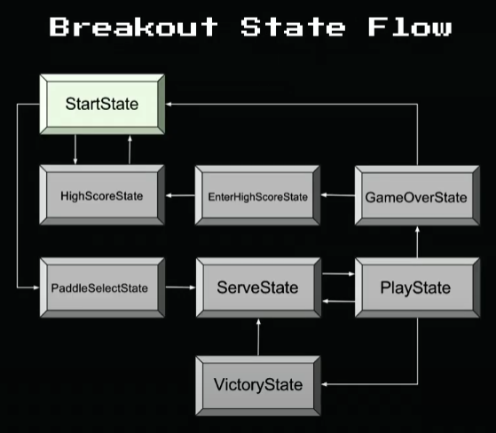
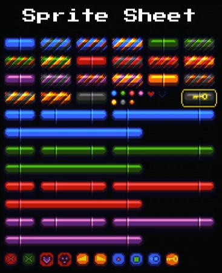
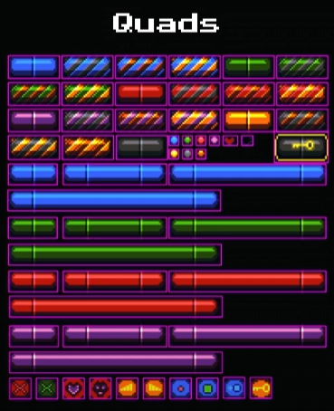
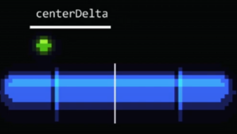
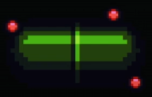
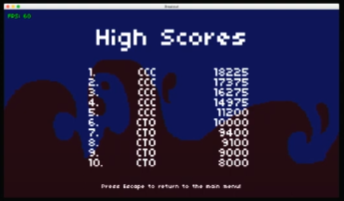

# **Breakout**



## **breakout0 ( Day-0 Update)**

Previously, we had all the files in the root level which clutters up the top-level of the game directory as the game complexity increases. So, this time we organize the files into directories which make it easier to manage and also work with.

### Folder Structure
- **`fonts/`** - folder that contains all the font files
- **`graphics/`** - folder that comtains all the images (graphics)
- **`lib/`** - folder that contains all the pre-defined library files (push, Class)
- **`sounds/`** - folder to store all the sound effects and music files
- **`src/`** - folder that stores the main game's code or files
    - **`constants.lua`**: has all the constants variable declarations
    - **`Dependencies.lua`**: has all the "require" that used to be there at the top of **`main.lua`** previously i.e., it imports all the libraries and other game files
    - **`states/`**: folder that has all the state implementation files
    - **`main.lua`**: core or main source code file from where execution starts
    - **`StateMachine.lua`**: a simple implementation of a state machine


### Code

```lua
-- [[ main.lua ]]
require 'src/Dependencies'


function love.load()
    -- set love's default filter to "nearest-neighbor"
    -- so there will be no filtering of pixels (blurriness)
    -- which is gives a nice crisp, 2D look
    love.graphics.setDefaultFilter('nearest', 'nearest')

    -- seed the RNG so that calls to random are always random
    math.randomseed(os.time())

    -- set the application title bar
    love.window.setTitle('Breakout')

    -- initialize text fonts
    gFonts = {
        ['small'] = love.graphics.newFont('fonts/font.ttf', 8),
        ['medium'] = love.graphics.newFont('fonts/font.ttf', 16),
        ['large'] = love.graphics.newFont('fonts/font.ttf', 32)
    }
    love.graphics.setFont(gFonts['small'])

    -- load up the graphics
    gTextures = {
        ['background'] = love.graphics.newImage('graphics/background.png'),
        ['main'] = love.graphics.newImage('graphics/breakout.png'),
        ['arrows'] = love.graphics.newImage('graphics/arrows.png'),
        ['hearts'] = love.graphics.newImage('graphics/hearts.png'),
        ['particle'] = love.graphics.newImage('graphics/particle.png')
    }
    
    -- initialize virtual resolution, which will be rendered within our
    -- actual window no matter its dimensions
    push:setupScreen(VIRTUAL_WIDTH, VIRTUAL_HEIGHT, WINDOW_WIDTH, WINDOW_HEIGHT, {
        vsync = true,
        fullscreen = false,
        resizable = true
    })

    -- set up our sound effects
    gSounds = {
        ['paddle-hit'] = love.audio.newSource('sounds/paddle_hit.wav', 'static'),
        ['score'] = love.audio.newSource('sounds/score.wav', 'static'),
        ['wall-hit'] = love.audio.newSource('sounds/wall_hit.wav', 'static'),
        ['confirm'] = love.audio.newSource('sounds/confirm.wav', 'static'),
        ['select'] = love.audio.newSource('sounds/select.wav', 'static'),
        ['no-select'] = love.audio.newSource('sounds/no-select.wav', 'static'),
        ['brick-hit-1'] = love.audio.newSource('sounds/brick-hit-1.wav', 'static'),
        ['brick-hit-2'] = love.audio.newSource('sounds/brick-hit-2.wav', 'static'),
        ['hurt'] = love.audio.newSource('sounds/hurt.wav', 'static'),
        ['victory'] = love.audio.newSource('sounds/victory.wav', 'static'),
        ['recover'] = love.audio.newSource('sounds/recover.wav', 'static'),
        ['high-score'] = love.audio.newSource('sounds/high_score.wav', 'static'),
        ['pause'] = love.audio.newSource('sounds/pause.wav', 'static'),

        ['music'] = love.audio.newSource('sounds/music.wav', 'static')
    }

    -- the state machine: 
    -- 1. 'start' (the beginning of the game, where we're told to press Enter)
    -- 2. 'paddle-select' (where we get to choose the color of our paddle)
    -- 3. 'serve' (waiting on a key press to serve the ball)
    -- 4. 'play' (the ball is in play, bouncing between paddles)
    -- 5. 'victory' (the current level is over, with a victory jingle)
    -- 6. 'game-over' (the player has lost; display score and allow restart)
    gStateMachine = StateMachine {
        ['start'] = function() return StartState() end
    }
    gStateMachine:change('start')

    -- a table used to keep track of keys pressed
    love.keyboard.keysPressed = {}
end


function love.resize(w, h)
    push:resize(w, h)
end


function love.update(dt)
    gStateMachine:update(dt)

    -- reset keys pressed
    love.keyboard.keysPressed = {}
end


function love.keypressed(key)
    -- add to table of keys pressed this frame
    love.keyboard.keysPressed[key] = true
end

-- custom global function whihc can be used to check for "key-presses"
function love.keyboard.wasPressed(key)
    if love.keyboard.keysPressed[key] then
        return true
    else
        return false
    end
end


function love.draw()
    push:apply('start')

    -- background should be drawn regardless of state
    local backgroundWidth = gTextures['background']:getWidth()
    local backgroundHeight = gTextures['background']:getHeight()

    love.graphics.draw(gTextures['background'], 
        0, 0, -- draw at coordinates 0, 0
        0, -- no rotation
        -- scale factors on X and Y axis so it fills the screen
        VIRTUAL_WIDTH / (backgroundWidth - 1), VIRTUAL_HEIGHT / (backgroundHeight - 1))

    -- the background image we are rendering has to be scaled becasue
    -- the actual image is a bit smaller than the virtual screen
    -- hence, by dividing the virtual screen dimensions by the actual image
    -- dimensions, we get the scale factor in both x, y dimensions
    
    -- use the state machine to defer rendering to the current state we're in
    gStateMachine:render()
    
    -- display FPS 
    displayFPS()
    
    push:apply('end')
end


function displayFPS()
    love.graphics.setFont(gFonts['small'])
    love.graphics.setColor(0, 1, 0, 1)
    love.graphics.print('FPS: ' .. tostring(love.timer.getFPS()), 5, 5)
end
```

### States

In the first update (Day-0 update), there are only 2 states: **`BaseState`** from which all other states will inherit and a **`StartState`** that is where the State Machine will start at.

The **`BaseState`** is a global state that will contain all the common properties and methods required commonly across all the states, where each of the individual states' implementation will over-write their specific implementations of those inherited functions.

```lua
-- [[ src/states/BaseState.lua ]]
BaseState = Class{}

function BaseState:init() end
function BaseState:enter() end
function BaseState:exit() end
function BaseState:update(dt) end
function BaseState:render() end
```

The **`StartState`** inherits from **`BaseState`** and renders the start screen of the game.

```lua
-- [[ src/states/StartState.lua ]]
StartState = Class{__includes = BaseState}

-- variable to denote which option is highlighted ("Start" or "High Scores")
local highlighted = 1

function StartState:update(dt)
    -- toggle highlighted option if we press an arrow key up or down
    if love.keyboard.wasPressed('up') or love.keyboard.wasPressed('down') then
        highlighted = highlighted == 1 and 2 or 1 -- inversion
        gSounds['paddle-hit']:play()
    end

    -- this is no longer global, so included here in StartState
    -- so, essentially user can quit only when in the StartState
    if love.keyboard.wasPressed('escape') then
        love.event.quit()
    end
end

function StartState:render()
    -- large title
    love.graphics.setFont(gFonts['large'])
    love.graphics.printf("BREAKOUT", 0, VIRTUAL_HEIGHT / 3,
        VIRTUAL_WIDTH, 'center')
    
    -- instructions
    love.graphics.setFont(gFonts['medium'])

    -- if we're highlighting 1, render that option blue
    if highlighted == 1 then
        love.graphics.setColor(103/255, 1, 1, 1)
    end
    love.graphics.printf("START", 0, VIRTUAL_HEIGHT / 2 + 70,
        VIRTUAL_WIDTH, 'center')

    -- reset the color to white
    love.graphics.setColor(1, 1, 1, 1)

    -- render option 2 blue if we're highlighting that one
    if highlighted == 2 then
        love.graphics.setColor(103/255, 1, 1, 1)
    end
    love.graphics.printf("HIGH SCORES", 0, VIRTUAL_HEIGHT / 2 + 90,
        VIRTUAL_WIDTH, 'center')

    -- reset the color to white
    love.graphics.setColor(1, 1, 1, 1)
end
```

## **breakout1 (The "Quad" Update)**

**Sprite Sheet**:  a single file where all the sprites used in the game will be stored. The Sprite Sheet can be indexed using *"rectangles"* defined for the individual sprites so we can pick out the sprites needed and use those.

Sprite Sheets are common in game development as that reduce a bunch of sprite files stored individually into just one file, making it easier to use and manage.

**`Quads`** are the rectangles (we pass in the x, y, w, h of the rectangle) that seperate out each of the sprite and render only that portion of the sprite sheet as and when needed

| Breakout Sprite Sheet | Breakout Sprite Sheet's Quads |
|:------------:|:-----:|
|  |  | 

### Functions relevant to Sprite Sheets (texture) and Quads

- **`love.graphics.newQuad(x, y, width, height, dimensions)`**: Specify rectangle boundaries of the Quad needed and pass in the dimensions (returned via `Image:getDimensions` on whichever texture we want to make a Quad for).
- **`love.graphics.draw(texture, quad, x, y)`**: Variant of `love.graphics.draw()` seen previously, but now we can pass in a Quad to draw *"just the specific part"* of the texture (sprite sheet) we want, not the entire texture itself.

### Code

Firstly, we will be introducing a new file **`src/Util.lua`** that will have the utility functions to interact with spritesheets and quads

```lua
-- [[ src/Util.lua ]]

-- Given an "atlas" (a texture with multiple sprites or a spritesheet), as well as 
-- a width and a height for the tiles therein, split the texture into all of the quads by dividing it evenly.
function GenerateQuads(atlas, tilewidth, tileheight)
    local sheetWidth = atlas:getWidth() / tilewidth
    local sheetHeight = atlas:getHeight() / tileheight

    local sheetCounter = 1
    local spritesheet = {}

    -- iterating from top-left
    for y = 0, sheetHeight - 1 do
        for x = 0, sheetWidth - 1 do
            -- spriteSheet is a table and hence 1-indexed
            -- index is the sheetCounter which is incremented in each iteration
            spritesheet[sheetCounter] =
                -- creating a new Quad for the specified tile
                love.graphics.newQuad(
                    x * tilewidth, -- x co-ord scaled by tile's width
                    y * tileheight, -- y co-ord scaled by tile's height
                    tilewidth, -- generic tileWidth
                    tileheight, -- generic tileHeight
                    atlas:getDimensions() -- dimensions of spritesheet
                )
            sheetCounter = sheetCounter + 1
        end
    end

    -- table of quads indexable using 1,2,3 ...
    return spritesheet -- spritesheet with all the divided quads
end

-- utility function for slicing tables
function table.slice(tbl, first, last, step)
    local sliced = {} -- resulting output sub-table
    
    -- first = 1 by default if nothing passed i.e., start 
    -- last = size of table (#tbl) by default i.e., end
    -- increment = step, if step not passed then = 1
    for i = first or 1, last or #tbl, step or 1 do
      -- sliced[#sliced+1] gives the index for the sub-table
      -- the current no: of entries + 1 (last index) 
      sliced[#sliced+1] = tbl[i]
    end
  
    return sliced -- output sub-table sliced according to first, last, step
end


-- function to piece out the paddles from the sprite sheet. 
-- this has to be done manually, since the paddles are of different sizes.
function GenerateQuadsPaddles(atlas)
    local x = 0 -- starting left left edge
    local y = 64 -- 4 rows of 16px present above the paddles

    local counter = 1
    local quads = {}

    -- 0-3 = 4 types of paddles
    for i = 0, 3 do
        -- smallest
        quads[counter] = love.graphics.newQuad(x, y, 32, 16,
            atlas:getDimensions())
        counter = counter + 1
        -- medium
        quads[counter] = love.graphics.newQuad(x + 32, y, 64, 16,
            atlas:getDimensions())
        counter = counter + 1
        -- large
        quads[counter] = love.graphics.newQuad(x + 96, y, 96, 16,
            atlas:getDimensions())
        counter = counter + 1
        -- huge (y+16 because huge paddle is in the next row)
        quads[counter] = love.graphics.newQuad(x, y + 16, 128, 16,
            atlas:getDimensions())
        counter = counter + 1

        -- prepare X and Y for the next set of paddles
        x = 0
        y = y + 32
    end

    return quads -- 4 sizes of 4 types of paddles giving 16 quads
end
```

```lua
-- [[ main.lua ]]

-- ...
function love.load()
    -- ...
    -- global table for the frames
    -- here the utility function GenerateQuadsPaddles() is used
    -- to create the paddles' quads and stored in gFrames
    gFrames = {
        ['paddles'] = GenerateQuadsPaddles(gTextures['main'])
    }
    -- ...
end
```

Now we have to model the paddle itself to work in the game. For this we have a **`src/Paddle.lua`** where all the paddle logic is implemented. 

```lua
Paddle = Class{}


function Paddle:init()
    self.x = VIRTUAL_WIDTH / 2 - 32 -- x is placed in the middle    
    self.y = VIRTUAL_HEIGHT - 32 -- y is placed a little above the bottom edge of the screen
    self.dx = 0 -- initially 0 velocity

    -- starting dimensions
    self.width = 64
    self.height = 16

    -- the skin only has the effect of changing our color,
    -- used to offset into the gPaddleSkins table later
    self.skin = 1

    -- the variant is which of the four paddle sizes to use
    -- currently size = 2 (medium size paddle)
    self.size = 2
end

function Paddle:update(dt)
    if love.keyboard.isDown('left') then
        self.dx = -PADDLE_SPEED
    elseif love.keyboard.isDown('right') then
        self.dx = PADDLE_SPEED
    else
        self.dx = 0
    end

    -- left edge collision => move paddle back to 0 or 
    -- calculated position using the velocity and dt
    -- math.max() ensures values doesn't fall below 0
    if self.dx < 0 then
        self.x = math.max(0, self.x + self.dx * dt)
    
    -- similar to left edge, right edge collision will
    -- move paddle back to the VIRTUAL_WIDTH - paddle width
    -- or calculated position using velocity and dt
    -- math.min() ensures values don't exceed screen width
    else
        self.x = math.min(VIRTUAL_WIDTH - self.width, self.x + self.dx * dt)
    end
end

-- rendering paddle by indexing into gFrames and into the specific quad
function Paddle:render()
    love.graphics.draw(
        gTextures['main'], -- texture
        -- specific size and skin of paddle
        -- when skin = 0, nothing added to self.size so 2nd
        -- skin = 1 => self.size + 4 which moves us 4 quads below
        -- that is the next set of paddles (next colour)
        -- that is when skin = 0, we are in the first quad and
        -- each set of paddles have 4 sizes, so for next skin
        -- we have to move across all those 4 sizes
        gFrames['paddles'][self.size + 4 * (self.skin - 1)],
        self.x, 
        self.y
    )
end
```

Now that the paddle has been implemented, we can start implementing the **`PlayState`** to test the paddle.

```lua
-- [[ src/states/PlayState.lua ]]
PlayState = Class{__includes = BaseState}

function PlayState:init()
    self.paddle = Paddle() -- instantiating the Paddle class
    self.paused = false -- initially game is not paused
end

function PlayState:update(dt)
    -- Pausing feature
    if self.paused then
        if love.keyboard.wasPressed('space') then
            self.paused = false
            gSounds['pause']:play()
        else
            return
        end
    elseif love.keyboard.wasPressed('space') then
        self.paused = true
        gSounds['pause']:play()
        return
    end

    -- update positions based on velocity
    self.paddle:update(dt)


    -- allowing users to quit in the PlayState also
    if love.keyboard.wasPressed('escape') then
        love.event.quit()
    end
end

function PlayState:render()
    self.paddle:render() -- render the paddle

    -- pause text, if paused
    if self.paused then
        love.graphics.setFont(gFonts['large'])
        love.graphics.printf("PAUSED", 0, VIRTUAL_HEIGHT / 2 - 16, VIRTUAL_WIDTH, 'center')
    end
end
```

## **breakout2 (The "Bounce" Update)**

Now that we have the **Paddle**, next is the **Ball** and also the functionality fo the ball to bounce upon collision with the paddle. Also, the ball must bounce off of the left, top and right walls.

### Code

```lua
-- [[ main.lua ]]
-- ...

function love.load()
    -- ...

    -- new utility function to generate the quads for the balls
    -- there are also 7 balls with different colours
    -- the balls sprite dimensions compared to bricks are: 
    -- 1 brick length = 4 balls, 1 brick height = 2 balls => 1 brick = 8 balls
    gFrames = {
        ['paddles'] = GenerateQuadsPaddles(gTextures['main']),
        ['balls'] = GenerateQuadsBalls(gTextures['main'])
    }

    -- ...
end
```

Implementing the **`GenerateQuadsBalls()`** utility function

```lua
-- [[ src/Util.lua ]]
-- ...

function GenerateQuadsBalls(atlas)
    -- find out the x and y values for where the balls are placed
    local x = 96 -- 3 columns of bricks (3*32)
    local y = 48 -- 3 rows of bricks (3*16)

    local counter = 1
    local quads = {}

    -- there are 2 rows of balls (4 in 1st row and 3 in the second)
    -- 1st row, 4 balls
    for i = 0, 3 do
        quads[counter] = love.graphics.newQuad(x, y, 8, 8, atlas:getDimensions())
        x = x + 8
        counter = counter + 1
    end

    x = 96
    y = 56 -- next row of balls

    -- 2nd row, 3 balls
    for i = 0, 2 do
        quads[counter] = love.graphics.newQuad(x, y, 8, 8, atlas:getDimensions())
        x = x + 8
        counter = counter + 1
    end

    return quads
end
```

Now that we have the function to get the Ball sprites out of the spritesheet into quads, next we must implement the Ball and it's functionality.

```lua
-- [[ src/Ball.lua ]]
Ball = Class{}

function Ball:init(skin)
    -- ball is 8 x 8 in dimension
    self.width = 8
    self.height = 8
    self.dy = 0 -- velocity along x-axis
    self.dx = 0 -- velocity along y-axis

    -- used to color of our ball, and to index the table of quads
    self.skin = skin
end

-- collision detection (AABB Collision Detection) function that determines
-- if ball collides with a given target argument
function Ball:collides(target)
    -- left edge of either crosses right edge of the other
    if self.x > target.x + target.width or target.x > self.x + self.width then
        return false
    end

    -- bottom edge of either is higher than the top edge of the other
    if self.y > target.y + target.height or target.y > self.y + self.height then
        return false
    end 

    -- if the above aren't true, they're overlapping
    return true
end

-- place ball in middle of screen with no movement
function Ball:reset()
    self.x = VIRTUAL_WIDTH / 2 - 2
    self.y = VIRTUAL_HEIGHT / 2 - 2
    self.dx = 0
    self.dy = 0
end

function Ball:update(dt)
    self.x = self.x + self.dx * dt
    self.y = self.y + self.dy * dt

    -- allow ball to bounce off walls
    if self.x <= 0 then -- collision with left edge
        self.x = 0 -- move ball left edge of screen
        -- reverse velocity to make it bounce with same speed
        self.dx = -self.dx 
        gSounds['wall-hit']:play()
    end

    if self.x >= VIRTUAL_WIDTH - 8 then -- collision with right edge
        self.x = VIRTUAL_WIDTH - 8 -- move ball to right edge of screen
        -- reverse velocity to make it bounce with same speed
        self.dx = -self.dx
        gSounds['wall-hit']:play()
    end

    if self.y <= 0 then -- collision with top edge
        self.y = 0 -- move ball to top edge of screen
        -- reverse velocity to make it bounce with same speed
        self.dy = -self.dy
        gSounds['wall-hit']:play()
    end
end

function Ball:render()
    -- gTexture is our global texture for all blocks
    -- gBallFrames is a table of quads mapping to each individual ball skin
    love.graphics.draw(
        gTextures['main'], -- texture
        -- index into balls table using the skin
        gFrames['balls'][self.skin],
        self.x, -- x value from where ball sprite begins
        self.y -- y value from where ball sprite begins
    )
end
```

Now that the **`Ball`** has been implemented, it must be added in the **`PlayState`**

```lua
PlayState = Class{__includes = BaseState}

function PlayState:init()
    self.paddle = Paddle()

    -- initialize ball with skin #1
    self.ball = Ball(1)

    -- give ball random starting velocity
    self.ball.dx = math.random(-200, 200)
    self.ball.dy = math.random(-50, -60)

    -- give ball position in the center
    self.ball.x = VIRTUAL_WIDTH / 2 - 4
    self.ball.y = VIRTUAL_HEIGHT - 42
end

function PlayState:update(dt)
    -- ...
    -- update positions based on velocity
    self.paddle:update(dt)
    self.ball:update(dt)

    if self.ball:collides(self.paddle) then
        -- reverse Y velocity if collision detected between paddle and ball
        self.ball.dy = -self.ball.dy
        gSounds['paddle-hit']:play()
    end
    -- ...
end

function PlayState:render()
    self.paddle:render()
    self.ball:render()

    -- pause text, if paused
    if self.paused then
        love.graphics.setFont(gFonts['large'])
        love.graphics.printf("PAUSED", 0, VIRTUAL_HEIGHT / 2 - 16, VIRTUAL_WIDTH, 'center')
    end
end
```

An issue in the **Ball-Paddle** collision detection is that if the ball comes at an angle towards the paddle, the `dy` will be inverted correctly, but `dx` won't be inverted. So, when the collision is detected, since it doesn't bounce properly it can cause infinite collision loop within the paddle i.e., `ball.y` is below `paddle.y`, but the `dy` change won't move it away as much as needed => collision is still detected with the paddle. 

So, the ball's position must be reset to the edge of the paddle so that the inverted velocity will be enough to bounce it away or else the ball clips onto the paddle and repeats collision.

## **breakout3 (The "Brick" Update)**

Now that the **Paddle** and the **Ball** are implemented and working, we can move onto the 3rd main component, the **Bricks**.

### Code

```lua
-- [[ main.lua ]]
-- ..

function love.load()
    -- ...
    gFrames = {
        ['paddles'] = GenerateQuadsPaddles(gTextures['main']),
        ['balls'] = GenerateQuadsBalls(gTextures['main']),
        ['bricks'] = GenerateQuadsBricks(gTextures['main']),
    }
    -- ...
end
-- ..
```

Now to implement the **`GenerateQuadsBricks()`**,

```lua
function GenerateQuadsBricks(atlas)
    return table.slice(
        GenerateQuads(atlas, 32, 16),
        1, 21 -- start from 1 go upto 21 (21 types)
    )
end
```

Now that the Bricks are extracted into the **`gFrames`**, we must implement the **`Brick`** class.

```lua
-- [[ src/Brick.lua ]]
Brick = Class{}

function Brick:init(x, y)
    -- used for coloring and score calculation
    self.tier = 0
    self.color = 1
    
    self.x = x
    self.y = y
    self.width = 32
    self.height = 16
    
    -- used to determine whether this brick should be rendered
    self.inPlay = true
end

-- Triggers a hit on the brick, taking it out of play 
-- if at 0 health or changing its color otherwise.
function Brick:hit()
    -- sound on hit
    gSounds['brick-hit-2']:play()

    self.inPlay = false
end

function Brick:render()
    if self.inPlay then
        love.graphics.draw(gTextures['main'], 
            -- multiply color by 4 (-1) to get our color offset, then add tier to that
            -- to draw the correct tier and color brick onto the screen
            gFrames['bricks'][1 + ((self.color - 1) * 4) + self.tier],
            self.x, self.y)
    end
end
```

Now the **`Brick`** must be added in the **`PlayState`**

```lua
-- [[ srs/states/PlayState.lua ]]
PlayState = Class{__includes = BaseState}

function PlayState:init()
    -- ...
    -- use the "static" createMap function to generate a bricks table
    self.bricks = LevelMaker.createMap()
end

function PlayState:update(dt)
    -- ...
    -- detect collision across all bricks with the ball
    for k, brick in pairs(self.bricks) do
        -- only check collision if brick is in play
        if brick.inPlay and self.ball:collides(brick) then
            -- trigger the brick's hit function, which removes it from play
            brick:hit()
        end
    end
    -- ...
end

function PlayState:render()
    -- render bricks
    for k, brick in pairs(self.bricks) do
        brick:render()
    end
    -- ...
end
```

**`PlayState`** has a **`LevelMaker`** that is used to create a map for generating the bricks. It returns a table that represents the map of bricks for that level.

```lua
-- [[ src/LevelMaker.lua ]]
LevelMaker = Class{} 

-- Creates a table of Bricks to be returned to the main game, with different
-- possible ways of randomizing rows and columns of bricks. 
-- Calculates the brick colors and tiers to choose based on the level passed in.
function LevelMaker.createMap(level)
    local bricks = {}
    local numRows = math.random(1, 5) -- randomly choose the number of rows
    local numCols = math.random(7, 13) -- randomly choose the number of columns

    -- lay out bricks such that they touch each other and fill the space
    for y = 1, numRows do
        for x = 1, numCols do
            b = Brick(
                -- x-coordinate
                (x-1) -- decrement x by 1 because tables are 1-indexed, coords are 0
                * 32  -- multiply by 32, the brick width
                + 8   -- the screen should have 8 pixels of padding; we can fit 13 cols + 16 pixels total
                + (13 - numCols) * 16, -- left-side padding for when there are fewer than 13 columns
                -- y-coordinate
                y * 16 -- just use y * 16, since we need top padding anyway
            ) 

            table.insert(bricks, b)
        end
    end 

    return bricks
end
```

## **breakout4 (The "Collision" Update)**

Right now the collision is such that when the **Ball** hits a **Brick**, the **Brick** stops rendering, but in the actual game, the when the **Ball** hits the **Brick**, the **Ball** must bounce off of the **Brick** too, and the hit Brick must either stop rendering (destroyed) or the variant changes.

Also,  all we know right now is that if the **Ball** collided with a target or not, we don't know from which angle or from where it collided. This is required to fix the collision so that the **Ball** bounces off of the target properly.

### Paddle Collision
- Take the mid-point of the **Paddle**, calculating how far off from the mid-point is the **Ball** when collision was detected, and amplify that in the **`ball.dx`** i.e., **`paddle.x + paddle.width/2 - ball.x`** will be the factor to scale **`ball.dx`**.
- Perform the operation on either side of the paddle based on the paddle's `dx`; if on the right side, the differential (`dx`) will be negative, so we need to call **`math.abs()`**to make it positive, then scale it by a positive amount to the `dx` becomes positive.

An illustration of Paddle collision for the left side of the paddle:



### Brick Collision
For Brick Collision, we determine which edge of the **Ball** is outside the **Brick** when a collision was detected. If one edge is touching the brick, then the opposite edge is "outside" the brick, which is what tells from which side that the **Ball** has collided with the **Brick**.

| Edge outside Brick | Differential value | Side of collision |
|:------------------:|:------------------:|:-----------------:|
| ***left edge of Ball is outside Brick*** | `dx` is positive | **left-side collision** |
| ***Right edge of Ball is outside Brick*** | `dx` is negative | **right-side collision** |
| ***Top edge of Ball is outside Brick*** | `dy` is positive | **top-side collision** |
| ***None of the above*** | `dy` is negative | **bottom-side collision** |

An illustration of Brick Collision:



This Collision mechanism is a simple implementation and very rarely has some issues when Ball hits corners of the Brick. Alternative ways:
> ***https://github.com/noooway/love2d_arkanoid_tutorial***
> ***https://github.com/nooway/love2d_arkanoid_tutorial/Resolving-Collisions***

### Code

The above collision logic is implemented in **`PlayState`**.

```lua
-- [[ src/states/PlayState.lua ]]
PlayState = Class{__includes = BaseState}

-- function PlayState:init() ...

function PlayState:update(dt)
    -- ...

    -- PADDLE COLLISION ---------------------------------------------------
    if self.ball:collides(self.paddle) then
        -- raise ball above paddle in case it goes below it, then reverse dy
        self.ball.y = self.paddle.y - 8
        self.ball.dy = -self.ball.dy

        -- tweak angle of bounce based on where it hits the paddle
        -- if we hit the paddle on its left side while moving left...
        -- i.e., ball.x < paddle's mid-point
        if self.ball.x < self.paddle.x + (self.paddle.width / 2) and 
           self.paddle.dx < 0 then -- paddle moving left
            self.ball.dx = -50 + -(
                -- ball.width * (scale factor)
                -- scale factor = (mid-point of paddle - ball.x)
                8 * (self.paddle.x + self.paddle.width / 2 - self.ball.x)
            ) -- -50 to make product positive
        
            -- else if we hit the paddle on its right side while moving right...
            -- i.e., ball.x > paddle's mid-point
        elseif self.ball.x > self.paddle.x + (self.paddle.width / 2) and 
               self.paddle.dx > 0 then -- paddle moving right
            self.ball.dx = 50 + (
                -- ball.width * math.abs(scale factor)
                -- scale factor = (mid-point of paddle - ball.x)
                -- math.abs() required to make scale factor positive
                8 * math.abs(self.paddle.x + self.paddle.width / 2 - self.ball.x)
            )
        end

        gSounds['paddle-hit']:play()
    end

    -- BRICK COLLISION ---------------------------------------------------------
    -- detect collision across all bricks with the ball
    for k, brick in pairs(self.bricks) do

        -- only check collision if we're in play
        if brick.inPlay and self.ball:collides(brick) then

            -- trigger the brick's hit function, which removes it from play
            brick:hit()

            -- if the opposite side of our velocity is outside of the brick;
            -- trigger a collision on that side; else we're within the X + brick.width
            -- so check to see if the top or bottom edge is outside of the brick,
            -- colliding on the top or bottom accordingly 

            -- left edge; only check if we're moving right i.e.,
            -- +2 added to work-around the corners a little bit
            -- ball not touching left edge of brick (brick.x) and moving right
            if self.ball.x + 2 < brick.x and self.ball.dx > 0 then
                
                -- flip x velocity and reset position outside of brick
                self.ball.dx = -self.ball.dx -- bounce ball to left
                self.ball.x = brick.x - 8 -- reset position of ball
            
            -- right edge; only check if we're moving left
            -- +6 added to work-around the corners a little bit
            -- ball not touching right edge of brick (brick.x + brick.width) and moving left
            elseif self.ball.x + 6 > brick.x + brick.width and self.ball.dx < 0 then
                
                -- flip x velocity and reset position outside of brick
                self.ball.dx = -self.ball.dx
                self.ball.x = brick.x + 32
            
            -- top edge if no X collisions, always check
            elseif self.ball.y < brick.y then
                
                -- flip y velocity and reset position outside of brick
                self.ball.dy = -self.ball.dy
                self.ball.y = brick.y - 8
            
            -- bottom edge if no X collisions or top collision, last possibility
            else
                
                -- flip y velocity and reset position outside of brick
                self.ball.dy = -self.ball.dy
                self.ball.y = brick.y + 16
            end

            -- slightly scale the y velocity to speed up the game
            self.ball.dy = self.ball.dy * 1.02

            break -- only allow colliding with one brick, for corners
        end
    end
    -- ...
end
-- ...
```

## **breakout5 (The "Hearts" Update)**

3 hearts provided, if ball falls below bottom edge of screen, a life is taken and upon losing all 3 lives a Game Over screen is shown with the score obtained.

Also, we will be adding the **`ServeState`** that comes before the **`PlayState`** and after the **`StartState`** when user enters the START option.

### Code

Firstly, we establish a paradigm where we remove the need to define global variables (except the assets) and pass the "state" of the game along with the state transitions.

This is helpful because:
- we don't pollute the global namespace with a bunch of global variables
- we can selectively pass only required parameters to the corresponding states
- this is a more commonly practised paradigm in game and web development of passing the required infirmation between states (or webpages in web development)

```lua
-- [[ src/states/StartState.lua ]]
-- ...

function StartState:update(dt)
    -- ...

    -- passing the core components of the game to a state
    -- these passed values will be available in it's enter() function
    if highlighted == 1 then
        gStateMachine:change('serve', {
            paddle = Paddle(1),
            bricks = LevelMaker.createMap(),
            health = 3,
            score = 0
        })
    end
    -- ...
end

-- function StartState:render() ...
```

Since we will be adding hearts in the game now, we need to extract the sprite for the hearts. Heart sprites in our spritesheet are evenly divided so we can just use the **`GenerateQuads()`** directly. Also, after extracting the heart sprites, we need to render it on screen.

```lua
-- [[ main.lua ]]
-- ...

function love.load()
    -- ...
    gFrames = {
        ['paddles'] = GenerateQuadsPaddles(gTextures['main']),
        ['balls'] = GenerateQuadsBalls(gTextures['main']),
        ['bricks'] = GenerateQuadsBricks(gTextures['main']),
        ['hearts'] = GenerateQuadsBricks(gTextures['hearts'], 10, 9)
    }
    -- ...
end

function renderHealth(health)
    local healthX = VIRTUAL_WIDTH - 100 -- top-right corner

    -- render hearts left
    for i=1, health do
        love.graphics.draw(
            gTextures['hearts'], -- texture
            gFrames['hearts'][1], -- quad
            healthX, 4  -- x, y co-ordinates
        )
        healthX = healthX + 11 -- gap of 11 px between hearts
    end

    -- render missing hearts (3 - remaining)
    for i=1, 3 - health do
        love.graphics.draw(
            gTextures['hearts'], -- texture
            gFrames['hearts'][2], -- quad
            healthX, 4  -- x, y co-ordinates
        )
        healthX = healthX + 11 -- gap of 11 px between hearts
    end
end
-- ...

-- a function to render the score
function renderScore(score)
    love.graphics.setFont(gFonts['small'])
    love.graphics.print('Score:', VIRTUAL_WIDTH - 60, 5)
    love.graphics.printf(tostring(score), VIRTUAL_WIDTH - 50, 5, 40, 'right')
end
```

We can make use of the **`renderHealth()`** and the **`renderScore()`** functions in **`PlayState`** (or any other state as needed). Also, we need to add the logic of losing a heart.

```lua
-- [[ src/states/PlayState.lua ]]
-- ...

function love.update(dt)
    -- PADDLE COLLISION ...
    -- BRICK COLLISION 
    for k, brick in pairs(self.bricks) do
        if brick.inPlay and self.ball:collides(brick) then
            self.score = self.score + 10 -- +10 score upon hitting a brick
            -- ...
        end
        -- ...
    end
    -- ...

    if self.ball.y >= VIRTUAL_HEIGHT then --ball crosses bottom edge
        self.health = self.health - 1
        gSounds['hurt']:play()

        if self.health == 0 then -- GAME OVER
            gStateMachine:change('game-over', {
                score = self.score
            })
        else -- still hearts left => SERVE
            gStateMachine:change('serve', {
                paddle = self.paddle,
                bricks = self.bricks,
                health = self.health,
                score = self.score
            })
        end
    end
end
-- ...

function PlayState:render()
    -- ...
    renderScore(self.score)
    renderHealth(self.health)
    -- ...
end
```

## States (ServeState, GameOverState)

```lua
-- [[ src/states/ServeState.lua ]]
ServeState = Class{__includes = BaseState}

function ServeState:enter(params)
    -- params is passed to the state while transitioning
    self.paddle = params.paddle
    self.bricks = params.bricks
    self.health = params.health
    self.score = params.score

    self.ball = Ball()
    self.ball.skin = math.random(7)
end

function ServeState:update(dt)
    self.paddle:update(dt)
    self.ball.x = self.paddle.x + (self.paddle.width / 2) - 4
    self.ball.y = self.paddle.y - 8

    if love.keyboard.wasPressed('enter') or love.keyboard.wasPressed('return') then
        -- transition to PlayState and pass al the required information
        gStateMachine:change('play', {
            paddle = self.paddle,
            bricks = self.bricks,
            health = self.health,
            score = self.score,
            ball = self.ball
        })
    end

    if love.keyboard.wasPressed('escape') then
        love.event.quit()
    end
end

function ServeState:render()
    self.paddle:render()
    self.ball:render()

    for k, brick in pairs(self.bricks) do
        brick:render()
    end

    renderScore(self.score)
    renderHealth(self.health)

    love.graphics.setFont(gFonts['medium'])
    love.graphics.printf('Press Enter to serve!', 0, VIRTUAL_HEIGHT / 2,
        VIRTUAL_WIDTH, 'center')
end
```

**`GameOverState`** mainly has to show the score of the player and provide a transition to start a new game.

```lua
-- [[ src/states/GameOverState.lua ]]
GameOverState = Class{__includes = BaseState}

function GameOverState:enter(params)
    self.score = params.score -- requires to show only the score
end

function GameOverState:update(dt)
    if love.keyboard.wasPressed('enter') or love.keyboard.wasPressed('return') then
        gStateMachine:change('start')
    end

    if love.keyboard.wasPressed('escape') then
        love.event.quit()
    end
end

function GameOverState:render()
    love.graphics.setFont(gFonts['large'])
    love.graphics.printf('GAME OVER', 0, VIRTUAL_HEIGHT / 3, VIRTUAL_WIDTH, 'center')
    love.graphics.setFont(gFonts['medium'])
    love.graphics.printf('Final Score: ' .. tostring(self.score), 0, VIRTUAL_HEIGHT / 2,
        VIRTUAL_WIDTH, 'center')
    love.graphics.printf('Press Enter!', 0, VIRTUAL_HEIGHT - VIRTUAL_HEIGHT / 4,
        VIRTUAL_WIDTH, 'center')
end
```

Right now, the game's core functionality of
- Paddle, Ball and Brick elements
- Paddle moving based on left and right arrow key inputs
- Ball moving upon collision with Paddle, walls or Bricks
- Collision and bouncing of Ball
- Ball falls below bottom edge of screen takes a life from player
- Hearts and score functionality

have been implemented and the game is in a "playable" state.

## **breakout6 (The "Pretty Colours" Update)**

Right now, all the bricks are of the same colours. The bricks are generated by the **`LevelMaker`**, in which only one type/tier of brick is being generated. To add the varying colours and tiers of bricks, changes have to be made to the **`LevelMaker.lua`** to return a more varied map of bricks.

```lua
-- global patterns (used to make the entire map a certain shape)
NONE = 1
SINGLE_PYRAMID = 2
MULTI_PYRAMID = 3

-- per-row patterns
SOLID = 1           -- all colors the same in this row
ALTERNATE = 2       -- alternate colors
SKIP = 3            -- skip every other block
NONE = 4            -- no blocks this row

LevelMaker = Class{}

function LevelMaker.createMap(level)
    local bricks = {}

    -- randomly choose the number of rows
    local numRows = math.random(1, 5)

    -- randomly choose the number of columns, ensuring odd
    local numCols = math.random(7, 13)
    numCols = numCols % 2 == 0 and (numCols + 1) or numCols

    -- highest possible spawned brick color in this level
    -- ensure we don't go above 3
    local highestTier = math.min(3, math.floor(level / 5))

    -- highest color of the highest tier
    local highestColor = math.min(5, level % 5 + 3)

    -- lay out bricks such that they touch each other and fill the space
    for y = 1, numRows do
        -- whether we want to enable skipping for this row
        local skipPattern = math.random(1, 2) == 1 and true or false

        -- whether we want to enable alternating colors for this row
        local alternatePattern = math.random(1, 2) == 1 and true or false
        
        -- choose two colors to alternate between
        local alternateColor1 = math.random(1, highestColor)
        local alternateColor2 = math.random(1, highestColor)
        local alternateTier1 = math.random(0, highestTier)
        local alternateTier2 = math.random(0, highestTier)
        
        -- used only when we want to skip a block, for skip pattern
        local skipFlag = math.random(2) == 1 and true or false

        -- used only when we want to alternate a block, for alternate pattern
        local alternateFlag = math.random(2) == 1 and true or false

        -- solid color we'll use if we're not alternating
        local solidColor = math.random(1, highestColor)
        local solidTier = math.random(0, highestTier)

        for x = 1, numCols do
            -- if skipping is turned on and we're on a skip iteration...
            if skipPattern and skipFlag then
                -- turn skipping off for the next iteration
                skipFlag = not skipFlag

                -- Lua doesn't have a continue statement, so this is the workaround
                goto continue
            else
                -- flip the flag to true on an iteration we don't use it
                skipFlag = not skipFlag
            end

            b = Brick(
                -- x-coordinate
                (x-1)                   -- decrement x by 1 because tables are 1-indexed, coords are 0
                * 32                    -- multiply by 32, the brick width
                + 8                     -- the screen should have 8 pixels of padding; we can fit 13 cols + 16 pixels total
                + (13 - numCols) * 16,  -- left-side padding for when there are fewer than 13 columns
                
                -- y-coordinate
                y * 16                  -- just use y * 16, since we need top padding anyway
            )

            -- if we're alternating, figure out which color/tier we're on
            if alternatePattern and alternateFlag then
                b.color = alternateColor1
                b.tier = alternateTier1
                alternateFlag = not alternateFlag
            else
                b.color = alternateColor2
                b.tier = alternateTier2
                alternateFlag = not alternateFlag
            end

            -- if not alternating and we made it here, use the solid color/tier
            if not alternatePattern then
                b.color = solidColor
                b.tier = solidTier
            end 

            table.insert(bricks, b)

            -- Lua's version of the 'continue' statement
            ::continue::
        end
    end 

    -- in the event we didn't generate any bricks, try again
    if #bricks == 0 then
        return self.createMap(level)
    else
        return bricks
    end
end
```

Basically, we define a set of flags for the different formations, and initialize them using **`math.random()`** to ensure that the layout generated is different each time. Using the flags, we determine how the bricks must be generated for a specific row. In each iteration, we select 2 different radnom colours or tiers for **ALTERNATING** patter, single random colour or tier for **SOLID** pattern. For the **SKIP** pattern, we use the skip flag and provide it in the for loop so every loop, the increment will be "skipped" accordingly.

## **breakout7 (The "Tier" Update)**

Having different coloured bricks means nothing if they don't actually represent anything i.e., the different colours or tiers of bricks must have some variation with respect to each other to provide meaning to the different colours.

### Code

First, we need to add the logic of decrementing the tier and colour in the **`Brick.lua`**.

```lua
-- [[ src/Brick.lua ]]
Brick = Class{}

function Brick:init(x, y)
    -- used for coloring and score calculation
    self.tier = 0
    self.color = 1
    -- ...
end

function Brick:hit()
    -- sound on hit
    gSounds['brick-hit-2']:stop()
    gSounds['brick-hit-2']:play()

    -- if we're at a higher tier than the base, we need to go down a tier
    -- if we're already at the lowest color, else just go down a color
    if self.tier > 0 then
        if self.color == 1 then
            self.tier = self.tier - 1
            self.color = 5
        else
            self.color = self.color - 1
        end
    else
        -- if we're in the first tier and the base color, remove brick from play
        if self.color == 1 then
            self.inPlay = false
        else
            self.color = self.color - 1
        end
    end

    -- play a second layer sound if the brick is destroyed
    if not self.inPlay then
        gSounds['brick-hit-1']:stop()
        gSounds['brick-hit-1']:play()
    end
end
-- ...
```

Also, due the **`Bricks`** being different "tiers" the score must be updated accordingly.

```lua
-- [[ src/states/PlayState.lua ]]
-- ...

function PlayState:update(dt)
    -- ...

    -- detect collision across all bricks with the ball
    for k, brick in pairs(self.bricks) do
        -- only check collision if we're in play
        if brick.inPlay and self.ball:collides(brick) then

            -- add to score based on tier and colour
            self.score = self.score + (brick.tier * 200 + brick.color * 25)

            brick:hit() -- trigger brick's hit function
        -- ...
    end
    -- ...
end
-- ...
```

## **breakout8 (The "Particle" Update)**

**Particle systems**: provide an easier way to implement animations like fire or water which can be difficult to do with just the sprites. For example, a fire can be made using particle system, by spawning bunch of particles at the centre and spawning fewer at the edges, and all the particle spawning together will be provided some motion like going upwards (dy) and fade away to simulate a fire-like animation effect.

### Particle system functions for LOVE 
LOVE2D has a method/function for particle systems:

**`love.graphics.newParticleSystem(texture, particles)`**: takes in a particle texture and a maximum number of particles to be emitted, and creates a particle system we can emit from, update, and render.

> **More Info**: ***https://love2d.org/wiki/ParticleSystem***

In our game, each brick when hit will get a particle system where the particles when spawned will have the same colour as the brick that was hit. These particles will spread randomly outward, have a +ve y velocity (move downward) and have afixed lifetime after which the colour fades to transparent and the particles aren't seen anymore.

### Code

We will be setting up the particle system in the **`Brick.lua`**, as each brick needs to have one.

```lua
-- [[ src/Brick.lua ]]
Brick = Class{}

-- some of the colors in our palette (to be used with particle systems)
paletteColors = {
    [1] = {['r'] = 99, ['g'] = 155, ['b'] = 255}, -- blue
    [2] = {['r'] = 106,['g'] = 190,['b'] = 47},   -- green
    [3] = {['r'] = 217,['g'] = 87,['b'] = 9},     -- red
    [4] = {['r'] = 215,['g'] = 123,['b'] = 18},   -- purple
    [5] = {['r'] = 251,['g'] = 242,['b'] = 5}     -- gold
}

function Brick:init(x, y)
    -- ...
    -- particle system belonging to the brick, emitted on hit
    self.psystem = love.graphics.newParticleSystem(gTextures['particle'], 64)

    -- lasts between 0.5-1 seconds seconds
    self.psystem:setParticleLifetime(0.5, 1)

    -- give it an acceleration of anywhere between X1,Y1 and X2,Y2 (0, 0) and (80, 80) here
    -- gives generally downward 
    self.psystem:setLinearAcceleration(-15, 0, 15, 80)

    -- spread of particles; normal looks more natural than uniform, which is clumpy; numbers
    -- are amount of standard deviation away in X and Y axis
    self.psystem:setEmissionArea('normal', 10, 10)
end


function Brick:hit()
    -- set the particle system to interpolate between two colors; in this case,
    -- we give it our self.color but with varying alpha; brighter for higher tiers, fading to 0
    -- over the particle's lifetime (the second color)
    self.psystem:setColors(
        paletteColors[self.color].r / 255,
        paletteColors[self.color].g / 255,
        paletteColors[self.color].b / 255,
        55 * (self.tier + 1) / 255,
        paletteColors[self.color].r / 255,
        paletteColors[self.color].g / 255,
        paletteColors[self.color].b / 255,
        0
    )
    self.psystem:emit(64)

    -- ...
end

function Brick:update(dt)
    self.psystem:update(dt)
end

-- function Brick:render() ...

-- Need a separate render function for our particles so it can be called after all bricks are drawn;
-- otherwise, some bricks would render over other bricks' particle systems.
function Brick:renderParticles()
    love.graphics.draw(self.psystem, self.x + 16, self.y + 8)
end
```

## **breakout9 (The "Progression" Update)** 

Next, we need to add "levels" in our game. That is once all the **`Bricks`** in the current **`PlayState`** have been destroyed, the player moves onto the next level. 

For this,
- At the beginning of **`PlayState`** it must show which level player is on
- Once all **`Bricks`** are destroyed, it must show a screen saying "**Level Completed**", and re-enter the **`PlayState`** but with a different level setting.

### Code

Initially, when player selects "START" in the main menu (on **`StartState`**), we must pass a parameter ***level = 1*** to the **`PlayState`**.

```lua
-- [[ src/states/StartState.lua ]]
-- ...
function StartState:update(dt)
    -- ...
    if love.keyboard.wasPressed('enter') or love.keyboard.wasPressed('return') then
        gSounds['confirm']:play()

        if highlighted == 1 then
            gStateMachine:change('serve', {
                paddle = Paddle(1),
                bricks = LevelMaker.createMap(1),
                health = 3,
                score = 0,
                level = 1 -- at the beginning, level = 1
            })
        end
    end
    -- ...
end
```

In the **`PlayState`**, we need a way to check if all the **`Bricks`** were destroyed. Also we will intorduce a new state if the level was completed i.e., the **`VictoryState`**

```lua
-- [[ src/states/PlayState.lua ]]
PlayState = Class{__includes = BaseState}

function PlayState:enter(params)
    -- ...
    self.level = params.level -- additonal level parameter
    -- ...
end

function PlayState:update(dt)
    -- ...
    for k, brick in pairs(self.bricks) do
        -- ...
            -- go to our victory screen if there are no more bricks left
            if self:checkVictory() then
                gSounds['victory']:play()

                gStateMachine:change('victory', {
                    level = self.level,
                    paddle = self.paddle,
                    health = self.health,
                    score = self.score,
                    ball = self.ball
                })
            end
            -- ...
        -- ...
    end
    -- ...
end

-- function PlayState:render() ...
-- function to check if all the bricks are destroyed
-- brick.inPlay tells if a brick was destroyed or not
-- iterating over all the bricks based on this condition
function PlayState:checkVictory()
    for k, brick in pairs(self.bricks) do
        if brick.inPlay then
            return false
        end 
    end

    return true
end
```

Now to implement the **`VictoryState`**.

```lua
-- [[ src/states/VictoryState.lua ]]
VictoryState = Class{__includes = BaseState}

function VictoryState:enter(params)
    self.level = params.level
    self.score = params.score
    self.paddle = params.paddle
    self.health = params.health
    self.ball = params.ball
end

function VictoryState:update(dt)
    self.paddle:update(dt)

    -- have the ball track the player
    self.ball.x = self.paddle.x + (self.paddle.width / 2) - 4
    self.ball.y = self.paddle.y - 8

    -- go to play screen if the player presses Enter
    if love.keyboard.wasPressed('enter') or love.keyboard.wasPressed('return') then
        -- here is where the actual progression happens
        -- when player presses enter they move onto next level (level+1)
        -- also the levelmaker has a setting to make the levels harder
        -- so based on the new level value, it generates "harder" map
        gStateMachine:change('serve', {
            level = self.level + 1,
            bricks = LevelMaker.createMap(self.level + 1),
            paddle = self.paddle,
            health = self.health,
            score = self.score
        })
    end
end

function VictoryState:render()
    self.paddle:render()
    self.ball:render()

    renderHealth(self.health)
    renderScore(self.score)

    -- level complete text
    love.graphics.setFont(gFonts['large'])
    love.graphics.printf("Level " .. tostring(self.level) .. " complete!",
        0, VIRTUAL_HEIGHT / 4, VIRTUAL_WIDTH, 'center')

    -- instructions text
    love.graphics.setFont(gFonts['medium'])
    love.graphics.printf('Press Enter to serve!', 0, VIRTUAL_HEIGHT / 2,
        VIRTUAL_WIDTH, 'center')
end
```

## breakout10 (The "High-score" Update)

Up until now, all the data is lost when session is terminated. In our game, we want to store permanently, the session data namely the **high score** obtained in that session.

We will be using **`love.filesystem`** for writing data permanently to the filesystem of the player.

**`love.filesystem.setIdentity(identity)`**: sets the active subfolder in the default LOVE save directory for reading and writing file to.

**`love.filesystem.exists(path)`**: checks if a file exists in the active save directory

**`love.filesystem.write(path, data)`**: writes data, as a string, to the file location at path

**`love.filesystem.lines(path)`**: returns an iterator over the string lines in a file at path, located in the active identity path.

**`love.filesystem.getSaveDirectory()`**: returns the active save directory

For our implementation, we need to save the name and trhe corresponding score (max 10 values).



### Code

```lua
-- [[ main.lua ]]
-- ...
function love.load()
    --  ...
    gFonts = -- ...
    love.graphics.setFont(gFonts['small'])
    gTextures = -- ...
    gFrames = -- ...
    -- ...
    gSounds = -- ...
    gStateMachine = StateMachine {
        -- ...
        ['victory'] = function() return VictoryState() end,
        ['high-scores'] = function() return HighScoreState() end
    }
    gStateMachine:change('start', {
        highScores = loadHighScores()
    })
    -- ...
end

-- function love.resize(w, h) ...
-- function love.update(dt) ...
-- function love.keypressed(key) ...
-- function love.keyboard.wasPressed(key) ...
-- function love.draw() ...

function loadHighScores()
    love.filesystem.setIdentity('breakout')

    -- if the file doesn't exist, initialize it with some default scores
    if not love.filesystem.getInfo('breakout.lst') then
        local scores = ''
        for i = 10, 1, -1 do
            scores = scores .. 'KSP\n'
            scores = scores .. tostring(i * 1000) .. '\n'
        end

        love.filesystem.write('breakout.lst', scores)
    end

    -- flag for whether we're reading a name or not
    local name = true
    local currentName = nil
    local counter = 1

    -- initialize scores table with at least 10 blank entries
    local scores = {}

    for i = 1, 10 do
        -- blank table; each will hold a name and a score
        scores[i] = {
            name = nil,
            score = nil
        }
    end

    -- iterate over each line in the file, filling in names and scores
    for line in love.filesystem.lines('breakout.lst') do
        if name then
            scores[counter].name = string.sub(line, 1, 3)
        else
            scores[counter].score = tonumber(line) -- convert score string to number
            counter = counter + 1
        end

        -- flip the name flag
        name = not name
    end

    return scores
end

-- function renderHealth(health) ...
-- function displayFPS() ...
-- function renderScore(score) ...
```

## **breakout11 (The "Entry" Update)**

In the entry update, player is able to provide a name when they set a new high score. The name will be only of 3 characters that will move up or down based on arrow keys.

### Code

```lua
-- [[ src/states/EnterHighScoreState.lua ]]
EnterHighScoreState = Class{__includes = BaseState}

-- individual chars of our string
-- chars have an ASCII value so when the number is converted to a char
-- it becomes the corresponding character
local chars = {
    [1] = 65, -- A = 65 in ASCII
    [2] = 65,
    [3] = 65
}

-- char we're currently changing
local highlightedChar = 1

function EnterHighScoreState:enter(params)
    self.highScores = params.highScores
    self.score = params.score
    self.scoreIndex = params.scoreIndex
end

function EnterHighScoreState:update(dt)
    if love.keyboard.wasPressed('enter') or love.keyboard.wasPressed('return') then
        -- update scores table
        local name = string.char(chars[1]) .. string.char(chars[2]) .. string.char(chars[3])

        -- go backwards through high scores table till this score, shifting scores
        for i = 10, self.scoreIndex, -1 do
            self.highScores[i + 1] = {
                name = self.highScores[i].name,
                score = self.highScores[i].score
            }
        end

        self.highScores[self.scoreIndex].name = name
        self.highScores[self.scoreIndex].score = self.score

        -- write scores to file
        local scoresStr = ''

        for i = 1, 10 do
            scoresStr = scoresStr .. self.highScores[i].name .. '\n'
            scoresStr = scoresStr .. tostring(self.highScores[i].score) .. '\n'
        end

        love.filesystem.write('breakout.lst', scoresStr)

        -- :change() allows us to pass the highscores
        -- so the highscores table is like global
        gStateMachine:change('high-scores', {
            highScores = self.highScores
        })
    end

    -- scroll through character slots
    if love.keyboard.wasPressed('left') and highlightedChar > 1 then
        highlightedChar = highlightedChar - 1
        gSounds['select']:play()
    elseif love.keyboard.wasPressed('right') and highlightedChar < 3 then
        highlightedChar = highlightedChar + 1
        gSounds['select']:play()
    end

    -- scroll through characters 
    -- after Z go back to A, and before A go to Z
    if love.keyboard.wasPressed('up') then
        chars[highlightedChar] = chars[highlightedChar] + 1
        if chars[highlightedChar] > 90 then
            chars[highlightedChar] = 65
        end
    elseif love.keyboard.wasPressed('down') then
        chars[highlightedChar] = chars[highlightedChar] - 1
        if chars[highlightedChar] < 65 then
            chars[highlightedChar] = 90
        end
    end
end

function EnterHighScoreState:render()
    love.graphics.setFont(gFonts['medium'])
    love.graphics.printf('Your score: ' .. tostring(self.score), 0, 30,
        VIRTUAL_WIDTH, 'center')

    love.graphics.setFont(gFonts['large'])
    
    -- render all three characters of the name
    if highlightedChar == 1 then
        love.graphics.setColor(103/255, 1, 1, 1)
    end
    love.graphics.print(string.char(chars[1]), VIRTUAL_WIDTH / 2 - 28, VIRTUAL_HEIGHT / 2)
    love.graphics.setColor(1, 1, 1, 1)

    if highlightedChar == 2 then
        love.graphics.setColor(103/255, 1, 1, 1)
    end
    love.graphics.print(string.char(chars[2]), VIRTUAL_WIDTH / 2 - 6, VIRTUAL_HEIGHT / 2)
    love.graphics.setColor(1, 1, 1, 1)

    if highlightedChar == 3 then
        love.graphics.setColor(103/255, 1, 1, 1)
    end
    love.graphics.print(string.char(chars[3]), VIRTUAL_WIDTH / 2 + 20, VIRTUAL_HEIGHT / 2)
    love.graphics.setColor(1, 1, 1, 1)
    
    love.graphics.setFont(gFonts['small'])
    love.graphics.printf('Press Enter to confirm!', 0, VIRTUAL_HEIGHT - 18,
        VIRTUAL_WIDTH, 'center')
end
```

The high-score checking will be done in the **`GameOverState`**, as after every game, the player will enter the **`GameOverState`**, and we can check for the high score. If new high score then transition to the **`EnterHighScoreState`**, else the **`StartState`**.

```lua
-- [[ src/states/GameOverState.lua ]]
-- ...

function GameOverState:update(dt)
    if love.keyboard.wasPressed('enter') or love.keyboard.wasPressed('return') then
        -- see if score is higher than any in the high scores table
        local highScore = false

        -- keep track of what high score ours overwrites, if any
        local scoreIndex = 11

        -- check for highscore
        for i = 10, 1, -1 do
            local score = self.highScores[i].score or 0
            if self.score > score then
                highScoreIndex = i
                highScore = true
            end
        end

        -- if player has scored a new high score among the top 10
        if highScore then
            gSounds['high-score']:play()
            gStateMachine:change('enter-high-score', {
                highScores = self.highScores,
                score = self.score,
                scoreIndex = highScoreIndex
            }) 
        else 
            gStateMachine:change('start', {
                highScores = self.highScores
            }) 
        end
    end
    -- ...
end
-- ...
```

## **breakout12 (The "Paddle-Select" Update)**

Next, we can add an additional player interatiob feature that allows the player to select the colour of the paddle before starting the game. So after **`StartState`**, we transition to **`PaddleSelectState`** and then to the **`ServeState`**.

**`PaddleSelectState`** essentially is
- 2 arrows (left and right) and a paddle
- the arrows darken if there are no more types of paddles ahead of it
- the paddle changes colours based on the arrows i.e., it iterates through the different colours using the arrow keys

```lua
-- [[ src/states/PaddleSelectState.lua ]]
PaddleSelectState = Class{__includes = BaseState}

function PaddleSelectState:enter(params)
    self.highScores = params.highScores
end

function PaddleSelectState:init()
    -- the paddle we're highlighting; will be passed to the ServeState; when we press Enter
    self.currentPaddle = 1
end

function PaddleSelectState:update(dt)
    if love.keyboard.wasPressed('left') then
        if self.currentPaddle == 1 then
            gSounds['no-select']:play() -- no more on left side
        else
            gSounds['select']:play()
            self.currentPaddle = self.currentPaddle - 1
        end
    elseif love.keyboard.wasPressed('right') then
        if self.currentPaddle == 4 then
            gSounds['no-select']:play() -- no more on the right side
        else
            gSounds['select']:play()
            self.currentPaddle = self.currentPaddle + 1
        end
    end

    -- select paddle and move on to the serve state, passing in the selection
    if love.keyboard.wasPressed('return') or love.keyboard.wasPressed('enter') then
        gSounds['confirm']:play()

        gStateMachine:change('serve', {
            paddle = Paddle(self.currentPaddle),
            bricks = LevelMaker.createMap(1),
            health = 3,
            score = 0,
            highScores = self.highScores,
            level = 1
        })
    end

    if love.keyboard.wasPressed('escape') then
        love.event.quit()
    end
end

function PaddleSelectState:render()
    -- instructions
    love.graphics.setFont(gFonts['medium'])
    love.graphics.printf("Select your paddle with left and right!", 0, VIRTUAL_HEIGHT / 4,
        VIRTUAL_WIDTH, 'center')
    love.graphics.setFont(gFonts['small'])
    love.graphics.printf("(Press Enter to continue!)", 0, VIRTUAL_HEIGHT / 3,
        VIRTUAL_WIDTH, 'center')
        
    -- left arrow; should render normally if we're higher than 1, else
    -- in a shadowy form to let us know we're as far left as we can go
    if self.currentPaddle == 1 then
        -- tint; give it a dark gray with half opacity
        love.graphics.setColor(40/255, 40/255, 40/255, 128/255)
    end
    
    love.graphics.draw(gTextures['arrows'], gFrames['arrows'][1], VIRTUAL_WIDTH / 4 - 24,
        VIRTUAL_HEIGHT - VIRTUAL_HEIGHT / 3)
   
    -- reset drawing color to full white for proper rendering
    love.graphics.setColor(1, 1, 1, 1)

    -- right arrow; should render normally if we're less than 4, else
    -- in a shadowy form to let us know we're as far right as we can go
    if self.currentPaddle == 4 then
        -- tint; give it a dark gray with half opacity
        love.graphics.setColor(40/255, 40/255, 40/255, 128/255)
    end
    
    love.graphics.draw(gTextures['arrows'], gFrames['arrows'][2], VIRTUAL_WIDTH - VIRTUAL_WIDTH / 4,
        VIRTUAL_HEIGHT - VIRTUAL_HEIGHT / 3)
    
    -- reset drawing color to full white for proper rendering
    love.graphics.setColor(1, 1, 1, 1)

    -- draw the paddle itself, based on which we have selected
    love.graphics.draw(gTextures['main'], gFrames['paddles'][2 + 4 * (self.currentPaddle - 1)],
        VIRTUAL_WIDTH / 2 - 32, VIRTUAL_HEIGHT - VIRTUAL_HEIGHT / 3)
end
```

## **breakout13 (The "Music" Update)**

Adding a constant background music to the game. This is added in **`main.lua`**, so the music playing is there in all the states.

### Code

```lua
-- [[ main.lua ]]
-- ...
function love.load()
    -- ...
    gSounds['music']:play()
    gSounds['music']:setLooping(true)
    -- ...
end
-- ...
```